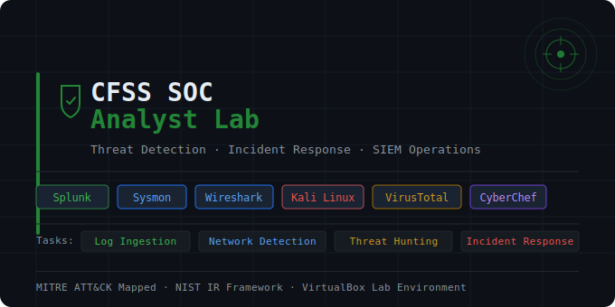

# 🛡️ CFSS SOC Analyst Lab

A hands-on Security Operations Center (SOC) lab built during my internship at CFSS.  
Simulated real-world attacks and practiced detection, threat hunting, and incident response.

## 🧰 Tools Used
- **SIEM:** Splunk Enterprise + Universal Forwarder
- **Endpoint Monitoring:** Sysmon (SwiftOnSecurity config)
- **Network Analysis:** Wireshark
- **Attack Simulation:** Kali Linux (Nmap, hping3)
- **Threat Intel:** VirusTotal, CyberChef
- **Lab Environment:** VirtualBox (Windows 10 VM + Kali Linux VM)

## 🏗️ Lab Architecture
- Windows 10 VM → Splunk Universal Forwarder → Splunk Enterprise (host)
- Kali Linux VM → simulates attacker on same NAT network

## 📁 Tasks Completed

| Task | Description |
|------|-------------|
| [Task 1 - Log Ingestion](./task1-log-ingestion/) | Sysmon setup, Windows Event Log forwarding, Splunk queries |
| [Task 2 - Network Attack Detection](./task2-network-attack/) | Nmap scan + SYN Flood simulation, Wireshark analysis |
| [Task 3 - Threat Hunting & Rule Creation](./task3-threat-hunting/) | Brute force alerts, hash analysis, PowerShell decode |
| [Task 4 - Incident Response](./task4-incident-response/) | NIST framework playbook, containment, eradication, recovery |

## 📊 Final Dashboard
Built a SOC Threat Monitoring Dashboard in Splunk covering:
- Brute Force Attempt Detection
- Network-Based Attack Activity (SYN Flood)
- Suspicious Process Execution Detection

## 🎯 Key Learnings
- Configured end-to-end SIEM pipeline from log source to alert
- Detected attacks at network, endpoint, and authentication layers
- Practiced real SOC incident response using NIST framework
